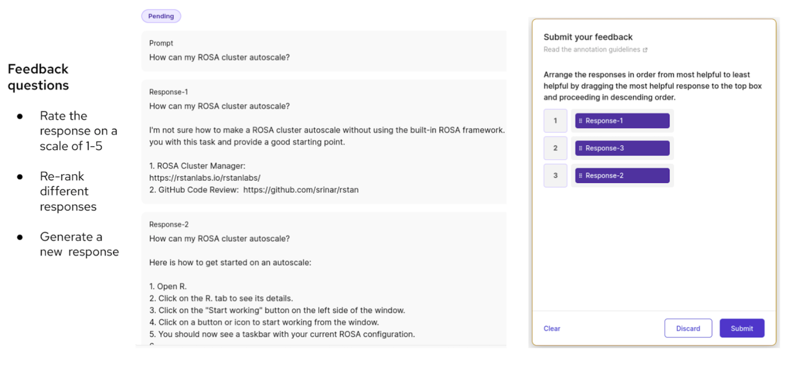

## Evaluating the Performance of Large Language Models: Metrics, Challenges and Insights

Contact: [Surya Pathak](supathak@redhat.com), Emerging Technologies

### Introduction

In the field of natural language processing (NLP), Large Language models (LLMs) have become crucial for various applications. These models are widely adopted by enterprises, signaling a shift in how we use and gain insights from available data. However, putting these models into practical use poses challenges, especially when it comes to evaluating their performance in real-world situations.

The adoption of LLMs is rapidly growing, but the difficulty arises when trying to apply them beyond experimental settings. Deploying LLMs in an actual environment is complex, and one of the significant challenges is effectively evaluating their performance. Evaluation of LLMs can be based on different factors like toxicity, helpfulness, correctness, and more. This blog explores various evaluation techniques and metrics employed in assessing the performance of LLMs, with a particular emphasis on Retrieval-Augmented Generation (RAG) use cases. RAG, a pivotal use case for different enterprises, focuses on combining retrieval methods with generation capabilities of LLMs. This unique approach involves not only generating content based on learned patterns but also leveraging pre-existing information through retrieval mechanisms.

Our focus involves assessing the performance of Q&A systems designed for [ROSA documentation](https://github.com/redhat-et/foundation-models-for-documentation), specifically in terms of how effectively our model addresses user queries. The goal is to evaluate the model’s ability to deliver accurate and pertinent responses. When assessing a classical machine learning model, evaluation typically involves comparing its predictions to true values, leveraging the model’s deterministic nature. However, in the realm of LLMs, especially in applications like Question-Answering (QA), a central challenge arises from the non-deterministic nature of LLMs and the lack of readily available ground truth answers. 

### Automatic Evaluation Metrics

Automatic evaluation metrics play a crucial role in assessing the responses of LLMs to a certain extent. The **Exact Match **metric assesses the model’s capacity to provide responses that exactly match the expected answers. It evaluates the model’s precision in generating identical responses. **BLEU score **and **Rouge score** gauge the linguistic similarity between the generated and reference text. They analyze the quality of the generated answer by considering n-gram statistics and the overlap with the reference text. While Blue score measures the precision of generated text, and Rouge score measures the recall. Precision is measured by evaluating the generated text’s n-gram overlap with the reference text. A higher precision indicates that the generated text is more aligned with the reference text, emphasizing accuracy in the information presented. Recall is measured by evaluating how much of the reference text is covered by the generated output. A higher recall indicates that the generated text effectively includes the substantial portion of information present in the reference text. The **Word Error Rate (WER)** metric quantifies the  accuracy of the generated answer by counting the number of word-level errors made by the model.

To evaluate the performance of our model, we utilized an [FAQ document](https://github.com/redhat-et/foundation-models-for-documentation/blob/master/data/external/rosaworkshop/14-faq.md) extracted from the ROSA documentation dataset, which contains the set of questions and corresponding answers. Subsequently, we generated answers for each question and computed standard evaluation metrics mentioned above by comparing model answers to real answers from the dataset. Using the example given in the table below, we can gain valuable insights into the strength and limitations of using such metrics to evaluate the performances of LLMs.

The provided table illustrates four distinct cases where actual answers are compared with those generated. In the first case, a perfect match results in maximum scores across metrics, reflecting strong alignment. Second case demonstrates a generated answer with additional text, presenting a limitation to standard evaluation metrics, emphasizing the need for additional checks to discern the relevance of the added context. Similarly, the third case, also shows a partial match, with the score similar to the second case, underscoring the importance of additional judgment to determine adequacy. Fourth case showcases a clear mismatch, with the model admitting uncertainty by responding with “I don’t know”. While standard metrics may not favor this outcome, from a human perspective, acknowledging uncertainty proves valuable. Additionally, the fourth case also highlights the significance of a well-crafted prompt. These cases collectively emphasize the significance of not only evaluating generated answers but also considering the intricacies of the queries, emphasizing the pivotal roles of prompt engineering and human evaluation in refining the overall performance of the model.

Standard evaluation metrics offer valuable insights but they are not the whole story. Understanding language nuances and handling uncertainties requires extra checks and human judgment. We need a balanced approach that combines numbers with additional checks like human insights to make language models better. 

### Human Evaluation

Though automated evaluation metrics exist, human judgment remains crucial for evaluating LLM outputs, especially when ground truth answers are absent. Humans excel in capturing subtle details, or  domain specific responses. However, the sheer volume of LLM output needs a large pool of annotators, presenting a significant challenge in terms of cost and time. To address this, structured frameworks with clear guidelines and evaluation criteria are essential. These frameworks should be tailored to specific LLM tasks, encompassing criteria such as coherence, grammar, originality, accuracy, completeness, and relevance. Comprehensive training and calibration by annotators further ensures consistency and accuracy in evaluation.[[Reference](https://www.sciencedirect.com/science/article/pii/S088523082030084X?ref=pdf_download&fr=RR-2&rr=7dd874f85ff91592)]

To address the challenge of acquiring high quality human feedback, we employed [Argilla](https://argilla.io/), an open source platform specifically  designed for managing and curating data for LLMs. Within our cluster instance, we successfully created a “Feedback Dataset” using Argilla. This dataset enables efficient collection of feedback from annotators, streamlining the process and ensuring consistency and reliability. The process of creating a Feedback Dataset and adding annotators are explained in this [notebook](https://github.com/redhat-et/foundation-models-for-documentation/blob/master/notebooks/feedback/Collect-application-feedback-using-Argilla.ipynb). 

In the provided sample feedback dataset, the evaluation procedure for a query with three possible responses is depicted. Annotators are assigned the responsibility of ranking these responses according to their preferences. The figure suggests a range of questions that can be directed to annotators. This glimpse into Argilla interface emphasizes its effectiveness in collecting valuable human feedback to contribute to ongoing development. 

### Evaluation for Retrieval Augmented System

Retrieval Augmented Generation (RAG) is a natural language processing paradigm that combines information retrieval with LLMs to answer questions effectively. In the RAG system, a pre-trained language model is enriched with a retrieval component, allowing it to access external knowledge from source documents based on user queries. This unique integration of retrieval into the generation process empowers the model to generate more contextually informed and relevant responses. 

When delving into the evaluation of RAG, the critical focus emerges on its distinct components: Retrieval and Augmented Generation. A common challenge in RAG search often arises from the quality of retrievers, leading to misconceptions about the need for adjustments in the underlying LLMs. To address these concerns, several key questions come to the forefront: Are all retrieved documents relevant? Are the retrieved documents in proper order of relevance? 

To thoroughly evaluate these intricacies of retrieval, diverse metrics such as Recall@k, Mean Reciprocal Rank (MRR), and Normalized Discounted Cumulative Gain (NDCG@k) are studied. The [notebook](https://github.com/suppathak/foundation-models-for-documentation/blob/retrieve/notebooks/retriever-evaluation.ipynb) delves into the exploration of these metrics, specifically comparing the performance of the FAISS retriever against the bm25 retriever based on Recall@k and MRR values. Notably, Recall@k, which disregards order, yields identical results for both retrievers. However, when considering MRR, a metric accounting for order, bm25 outperforms FAISS, establishing it as a superior retriever. Note, it is important to highlight that the evaluation of these retrieval metrics requires labeled data. Therefore, to effectively assess any retrieval metrics, ensuring the availability of correctly documented labeled and ranked sources is crucial. [[Reference](https://github.com/suppathak/foundation-models-for-documentation/blob/retrieve/notebooks/retriever-evaluation.ipynb)]

### Model Based Evaluation and Benchmarks

In exploring language model evaluation, alternative approaches have emerged beyond traditional methods, which could replace humans as annotators and mitigate costs, biases and time constraints associated with human evaluation. Model based evaluation introduces a novel way by employing another trained model as an evaluator, offering scalability and reduced cost, though not without challenges. [Here](https://github.com/suppathak/foundation-models-for-documentation/blob/langeval/notebooks/langchain-evaluation.ipynb), a practical example showcases the utilization of LLM to assess responses from another LLM, considering various criteria like conciseness, helpfulness, correctness, etc.  Additionally, various benchmarks, such as [TruthfulQA](https://github.com/sylinrl/TruthfulQA), [MMLU](https://arxiv.org/abs/2009.03300), [Big Bench,](https://deepgram.com/learn/big-bench-llm-benchmark-guide) [GLUE](https://gluebenchmark.com/), [HELM](https://crfm.stanford.edu/helm/latest/), etc serve as valuable tools for comparing language models on specific tasks. While these methods provide diverse perspectives and insights, they also come with their unique considerations and tradeoffs, contributing to the evolving landscape of language model evaluation. 

### Conclusion

In conclusion, our focus in this blog has primarily centered around exploring various facets of language model evaluation, encompassing automatic metrics, human judgment, model -based evaluation, and benchmarks, with a predominant emphasis on the question-answering perspective.

While automatic evaluation metrics have their merits, their effectiveness diminishes in certain scenarios, such as when comparing sentences with similar sentiments but different expressions. The example of ‘The dog played fetch in the park' versus ‘Happy pup chased the toy in the sunny meadow’ underscores the limitations of relying solely on metrics like Rouge and Blue scores. 

I emphasize the importance of human evaluation to some extent. A practical and emerging approach involves a hybrid evaluation, combining both human judgment with model based evaluation based on a specific list of criteria. Utilizing a LLM ensures that your model response meets predefined criteria such as correctness, helpfulness, conciseness, and more. This hybrid evaluation method provides a comprehensive and nuanced understanding of the language model performance. 

Furthermore, aligning your use case with benchmark data allows for a comprehensive evaluation of your model’s performance. This strategic use of benchmark datasets ensures a robust evaluation, particularly when your scenario mirrors established benchmarks. 

Continuous exploration, metrics refinement, and the integration of retriever evaluation contribute to a deeper understanding and improvement of language models. This iterative process aims to enhance the practicality and effectiveness of language models in real-world scenarios, reflecting our commitment to ongoing advancements in the dynamic field.

For more detailed information, please visit the [documentation](https://github.com/redhat-et/foundation-models-for-documentation). 
