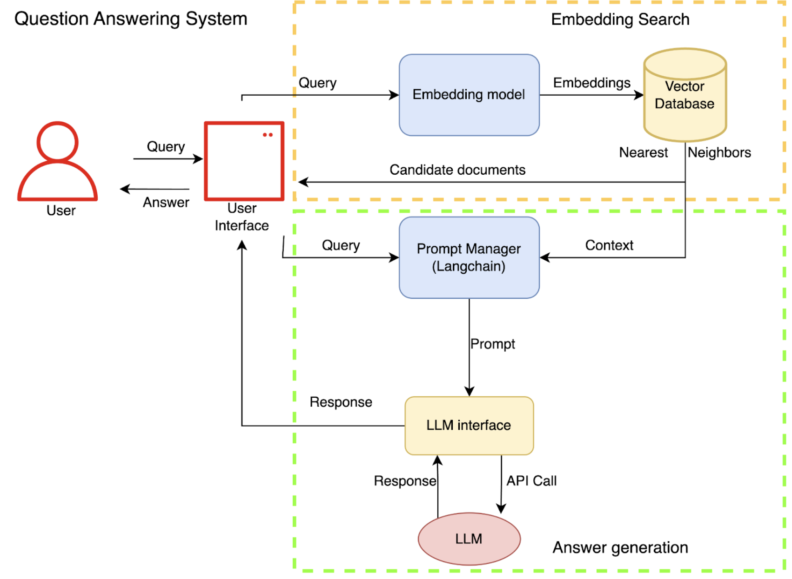
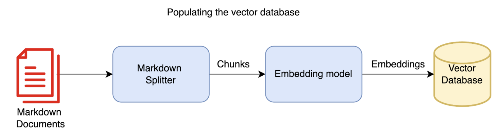
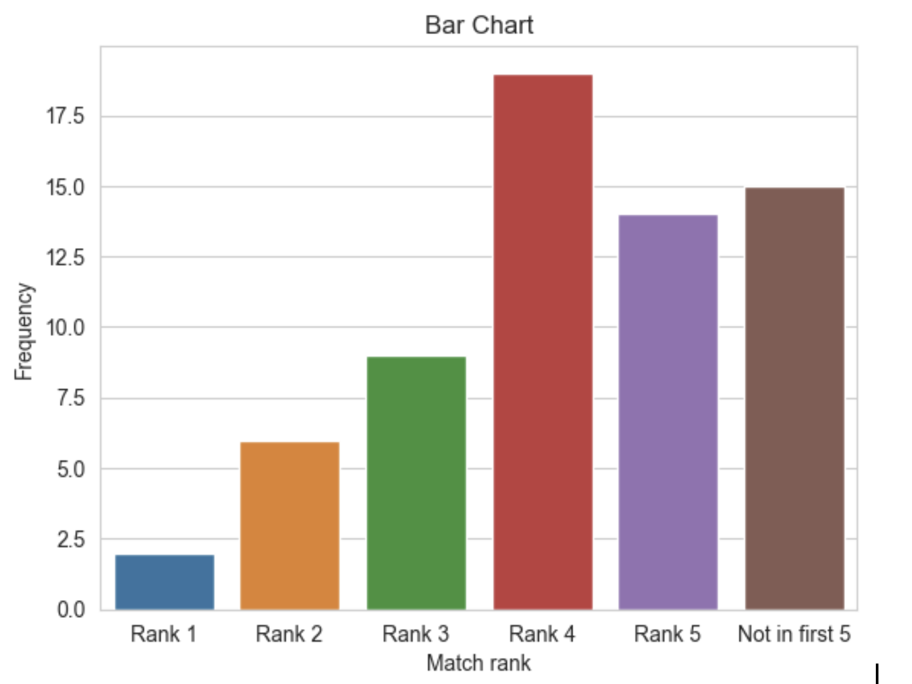

# Documentation search with foundation models - Red Hat Openshift on AWS

## Introduction

This blog covers a solution architecture and challenges around the primary objective of developing a robust Question-Answering system tailored to product documentation. The experiments and results show the system performance for public documentation of the Red Hat Openshift on AWS (ROSA) service. 

An instrumental application of  foundation models, or large language models (LLMs), is documentation search. LLMs can expand the scope of product support, enabling users to access specific details and insights without the need to manually sift through voluminous documents. Their ability to match the underlying semantics of user queries to product documents enables contextually relevant search results. Consequently, a well defined architecture with guardrails around LLMs can improve the time needed to arrive at solutions, thus expediting problem resolution and heightening overall customer satisfaction. 

## Dataset

The experiments use content sourced from publicly available ROSA service documents in markdown format.  These files are then compiled in the linked [repository](https://github.com/redhat-et/foundation-models-for-documentation/tree/master/data/external) as a dataset for the application to process. To validate the system, we use a [FAQ document](https://github.com/redhat-et/foundation-models-for-documentation/blob/master/data/external/rosaworkshop/14-faq.md) that is a collection of about 60 question-answer pairs about the ROSA service. In the evaluation phase, the FAQ answers serve as the ground truth against which we compare the model generated answers. 

## Approach
The fundamental method for creating a documentation search system comprises two essential components: information retrieval through embedding search and answer generation. This section will explain them in more detail.

### Embedding Search {#embedding-search}

Embeddings are numerical representations of sentences that enable comparison between sentence pairs. When sentences are encoded into numerical vectors, inter-vector distances can be used to identify sentences that are closely related to each other. This is a powerful capability for information retrieval from a database of documents. 

The initial step converts the documentation corpus into an intermediate representation of vectors that is subsequently stored in a vector database. In our example, the ROSA markdown files are partitioned into segments or chunks using a markdown splitter which is cognizant of headings. The embedding model then converts each chunk of the product documentation into a vector which is persisted in the vector database.  

#### Splitter

The raw documents often comprise thousands of words or tokens and therefore can not be directly used as input for the embedding model. Instead, the application meaningfully partitions them into chunks that can then be vectorized. Various strategies exist to partition the input depending on the nature of the input, be it code, markdown, or generic text. For our example demo, we use [markdown splitter by Langchain](https://python.langchain.com/docs/modules/data_connection/document_transformers/text_splitters/markdown_header_metadata). 

#### Embedding model

The embedding model is at the core of finding semantic representations of  text segments.. It is an area of active research tracked in this public [leaderboard](https://huggingface.co/spaces/mteb/leaderboard). The models are evaluated on text embedding datasets with tasks such as retrieval, clustering, and classification. There are both open source embedding models such as <code>[bge-large-en](https://github.com/FlagOpen/FlagEmbedding/tree/master)</code> with MIT license and paid services such as OpenAI’s embedding APIl. In our experiments we explore both alternatives. 

#### Vector database

The vector database indexes vectors, which are the representations of our text segments generated by the embedding model. The database performance is gauged in terms of how efficiently it can find the nearest neighbors of an input vector, achieved by utilizing approximate nearest neighbor (ANN) algorithms. With the rapid progress in the LLM field, several players in the vector database ecosystem such as Milvus, Qdrant, Chromadb have emerged. Stay tuned for their comparative study. 

#### Search

Once the vector database is populated, users can enter queries into the application. The embedding model converts the queries into their vector representations. Subsequently, the vector database finds the nearest neighbors for the query vector and suggests the associated documents of the nearest neighbors as potential candidates. 

#### Evaluation

The evaluation metrics draw inspiration from the information retrieval field. Among these, [Normalized Discounted Cumulative Gain](https://en.wikipedia.org/wiki/Discounted_cumulative_gain#:~:text=Normalized%20DCG,-Learn%20more&text=represents%20the%20list%20of%20relevant,a%20search%20engine's%20ranking%20algorithm.) is a prevalent measure, quantifying the usefulness, or _gain_, of a document based on its position in the result list. Upon examining the retrieved documents for questions in the validation dataset of ROSA documents, we observed that only in about 70% of the cases, the correct document was in the top five suggestions indicating the scope for refining the retrieval process. The following graph shows the rank at which the precise answer document was suggested upon querying.

### Answer generation

Once the application retrieves documents that potentially answer the query, the next step is to use a large language model to formulate the summarized answer for the user. 

#### Prompt Engineering and Management

The central component to this process is a prompt manager that provides tools to craft the prompt; essentially aiding in prompt engineering. It involves designing and refining the structure, wording, and context of the input prompts to achieve the desired outcomes from the model. In our approach, we leverage the capabilities of LangChain for this purpose. LangChain helps create the following custom template to combine the user query and candidate documents which are then fed to the LLM API that invokes the actual model for the final response. 

#### Large Language model and serving

The model that generates the final response is hosted on a server and can be accessed through an API. Organizations such as OpenAI and Huggingface provide APIs to access some of their state of the art models. In our study, we evaluate the approach using the OpenAI’s chat-GPT model, i.e. GPT-3.5-turbo. It’s important to note that the model’s source is not public and any data sent as input to the model is owned by OpenAI. In our future blogs, we will dive into creating and deploying our own custom models and interfacing with them. 

## Results 

The following table highlights three instances of the outcomes of the approach. The first column contains validation questions from the FAQ document. The second column contains the actual answer (or ground truth). The third column contains the generated answer by the approach without any prompt engineering and the last column contains the response generated with prompt engineering techniques. 

<table>
  <tr>
   <td>Question
   </td>
   <td>Actual Answer
   </td>
   <td>Generated answer 
   </td>
   <td>Prompt Engineering + Generated answer
   </td>
  </tr>
  <tr>
   <td>What exactly am I responsible for and what is Red Hat / AWS responsible for?
   </td>
   <td>In short, anything that is related to deploying the cluster or keeping the cluster running will be Red Hat’s or AWS’s responsibility, and anything relating to the applications, users, or data is the customers responsibility. Please see our responsibility <a href="https://docs.openshift.com/rosa/rosa_architecture/rosa_policy_service_definition/rosa-policy-responsibility-matrix.html">matrix</a> for more details.
   </td>
   <td>Red Hat OpenShift Service on AWS is managed by Red Hat SRE experts who will monitor and maintain the underlying platform so you don’t have to worry about the complexity of infrastructure management. Red Hat will also provide support for the OpenShift software component.
   </td>
   <td>Red Hat OpenShift Service on AWS (ROSA) is a fully-managed turnkey application platform that allows you to focus on what matters most, delivering value to your customers by building and deploying applications. Red Hat SRE experts manage the underlying platform so you don’t have to worry about the complexity of infrastructure management.

When you provision ROSA clusters, you will incur the infrastructure and OpenShift charges at the pay-as-you-go hourly rate. Red Hat and AWS are responsible for the monitoring and maintenance of the ROSA cluster, while the customer is responsible for the applications, workloads, and data that they deploy to the cluster. For more information, please refer to our <a href="https://docs.openshift.com/rosa/rosa_architecture/rosa_policy_service_definition/rosa-policy-responsibility-matrix.html">responsibility matrix</a> and <a href="https://www.openshift.com/products/amazon-openshift/pricing">pricing page</a>.
   </td>
  </tr>
  <tr>
   <td>Where can I go to get more information/details?
   </td>
   <td>ROSA Webpage

ROSA Workshop

ROSA Documentation
   </td>
   <td>You can find more information and details on the Homepage of the OCM UI, which includes links to additional resources.
   </td>
   <td>You can find more information about obtaining support for Red Hat OpenShift Service on AWS (ROSA) at the following links: 

ROSA Home Page

Adding Support Contacts

ROSA Documentation
   </td>
  </tr>
  <tr>
   <td>Which compliance certifications does ROSA have so far?
   </td>
   <td>Red Hat OpenShift Service on AWS is currently compliant with SOC-1, SOC-2 type 1 & type 2, ISO-27001, & PCI-DSS. We are also currently working towards FedRAMP High, HIPAA, ISO 27017 and ISO 27018 as well.
   </td>
   <td>ROSA has not yet obtained any compliance certifications.
   </td>
   <td>No, all nodes in a Red Hat OpenShift Service on AWS cluster must be located in the same AWS region; this follows the same model as that of OCP. For clusters configured for multiple availability zones control plane nodes and worker nodes will be distributed across the availability zones. For more information, please refer to the <a href="https://docs.openshift.com/rosa/welcome/index.html">Red Hat OpenShift Service on AWS documentation</a>.
   </td>
  </tr>
</table>

### Observations

1. The first example shows a successful outcome achieved from the approach. The query’s intent is to understand the distribution of responsibility between customers and the ROSA service providers. The answer, somewhat correct without any prompt engineering, becomes correct with prompt integration, complete with source links.
2. In the subsequent example, the query’s intent is to gather more information about the ROSA service. However it omits the words “ROSA service” and that necessitates a global level system-wide prompt. When the prompt is added, the approach understands the intent but still hallucinates links.  \

3. The third example shows an instance where the response is completely incorrect. The generated answer is false without the prompt and remains unrelated to the query even after adding the prompt.

## Discussion

The results suggest that certain components of the application, specifically the embedding search, answer generation and inference model, need improvement to reach the level suitable for a real world environment.

The embedding search phase should be enhanced by integrating keyword-based search algorithms, candidate documents reranking, and the current vector based approach. This strategy refers to combining more traditional information retrieval approaches with vector search resulting in [ensemble retrievers](https://python.langchain.com/docs/modules/data_connection/retrievers/ensemble). This phase gathers outcomes that are inherently valuable as the candidate documents are all factually correct and are highly relevant to the query. Presenting these outcomes as initial results serves as a resource friendly resolution to the query.

The answer generation phase can be improved by refined prompt engineering, integration of task planning agents and memory stores, and updates to the inference model itself. Refined prompt engineering involves strategies such as few shot prompting and chain of thought reasoning. These approaches ground the answers within the candidate documents reducing chances of hallucination. 

Improving the inference model to achieve truthful answers is an open area of research. On one front, using proprietary state of the art LLMs via paid APIs raise data privacy concerns. Conversely, hosting large language models incur considerable computational expenses. While there are smaller open models designed to imitate the larger models, their generalizability remains to be improved. Nevertheless, there is merit in the exercise of adapting or fine tuning an open model with domain specific data. In an upcoming blog, we will delve into fine tuning a Flan T5 model with ROSA QA data. 
